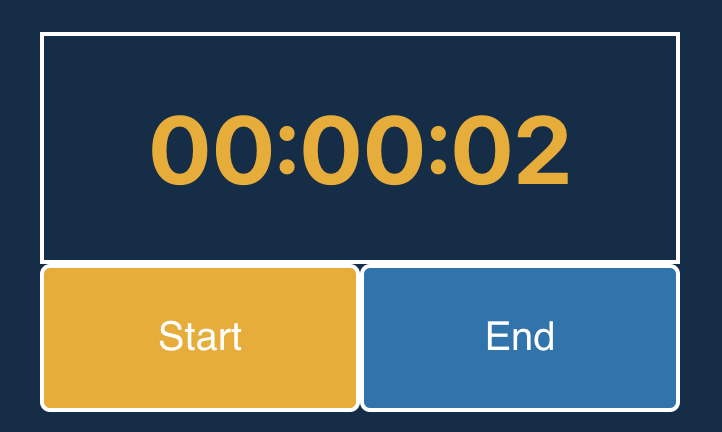

# Tinycog Timer
> Tinycog Timer provides a Timer and a Stopwatch for Elementor. 

The Timer counts down for the number of seconds specified and the Stopwatch counts up indefinitely. Both start with a configurable length pre count. 

## Installation

This is a Wordpress plugin that requires Elementor. 
- Install Wordpress
- Install Elementor in your Wordpress instance 
- Download the Zip of this project from Github
- Follow the instructions to install a plugin via upload or manual installation here [https://wordpress.org/support/article/managing-plugins/](Managing Plugins)

## Usage example

- Once installed, edit a page in Elementor. 
- In the widget explorer, look for the General section and look for Tinycog Timer - Timer and/or Tinycog Timer - Stopwatch. 
- Drag the control onto your form. 

One important note is that you will need to enter the total time required in seconds. For example, three minutes is 180 seconds. 

## Support 

Feel free to file issues in the [https://github.com/joshholmes/tinycog-timer/issues](Issues) on Github. Be aware that this is a hobby project so issues will be addressed as time permits with no guarentee or SLA. If you need an issue fixed urgently, please consider contributing to the project. 

## Release History

* 0.0.1
    * Basic Timer and Stopwatch completed and finctioning

## Meta

Josh Holmes – [@joshholmes](https://twitter.com/joshholmes) 

Distributed under the GPLv2 (or later). See ``LICENSE`` for more information.

[https://github.com/joshholmes/tinycog-timer](https://github.com/joshholmes/tinycog-timer)

## Contributing

1. Fork it (<https://github.com/joshholmes/tinycog-timer/fork>)
2. Create your feature branch (`git checkout -b feature/fooBar`)
3. Commit your changes (`git commit -am 'Add some fooBar'`)
4. Push to the branch (`git push origin feature/fooBar`)
5. Create a new Pull Request
